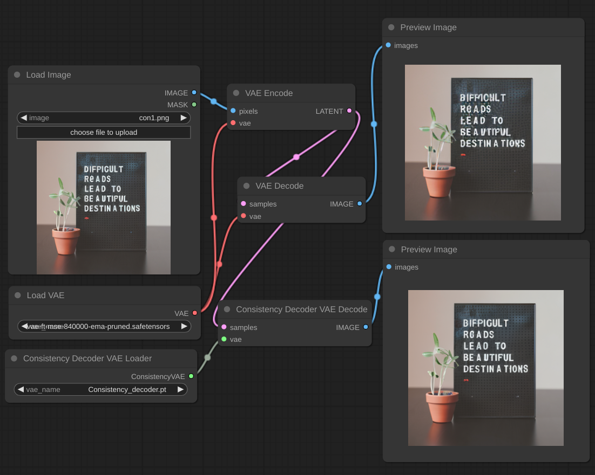

# Consistency Decoder Comfyui node

This project is a comfyui node adaption of Consistency Decoder (https://github.com/openai/consistencydecoder).

## Installation

put https://openaipublic.azureedge.net/diff-vae/c9cebd3132dd9c42936d803e33424145a748843c8f716c0814838bdc8a2fe7cb/decoder.pt to models/vae

# Hardware 
6GB vram for 512x512 in bf16.

# Link

https://github.com/openai/consistencydecoder  
https://github.com/lrzjason/ConsistencyDecoderNode  
https://gist.github.com/madebyollin/865fa6a18d9099351ddbdfbe7299ccbf  
https://huggingface.co/mrsteyk/consistency-decoder-sd15/blob/main/embedding.safetensors